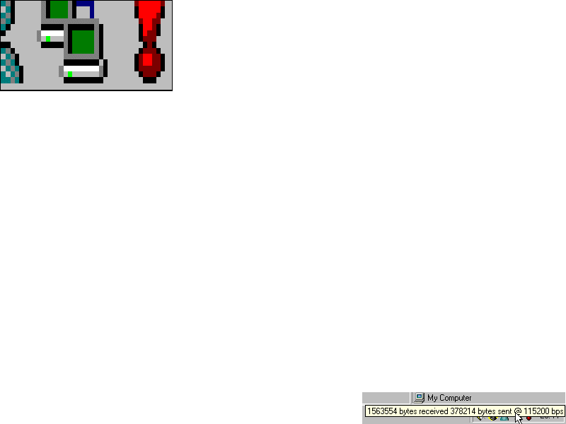



## Screen Magnifier =D

### Description

Its really simple - I think that it comes with windows (dunno which one), but its little form in the top of the screen that takes screen shots of the screen every millisecond and zooms in a few times. So I decided to make one myself :) only took about an hour, but i had to get the screen size right. Mine puts it in an image box and streches it a number of times, it is always ontop and in the system tray so you can hide and show it at anytime to save memory :)     If you like this please please vote and leave feedback and suggestions, Thanks
 
### More Info
 
Only runs OK in 800x600 mode

             |
---                |---
**Submitted On**   |2002-02-23 20:43:10
**By**             |[Richard Taylor](https://github.com/Planet-Source-Code/PSCIndex/blob/master/ByAuthor/richard-taylor.md)
**Level**          |Beginner
**User Rating**    |4.5 (18 globes from 4 users)
**Compatibility**  |VB 3\.0, VB 4\.0 \(16\-bit\), VB 4\.0 \(32\-bit\), VB 5\.0, VB 6\.0, VB Script, ASP \(Active Server Pages\) , VBA MS Access, VBA MS Excel
**Category**       |[Miscellaneous](https://github.com/Planet-Source-Code/PSCIndex/blob/master/ByCategory/miscellaneous__1-1.md)
**World**          |[Visual Basic](https://github.com/Planet-Source-Code/PSCIndex/blob/master/ByWorld/visual-basic.md)
**Archive File**   |[Screen\_Mag570752232002\.zip](https://github.com/Planet-Source-Code/richard-taylor-screen-magnifier-d__1-32066/archive/master.zip)

